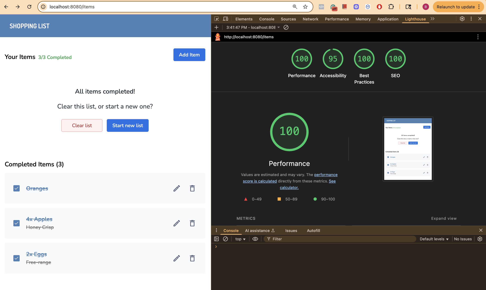
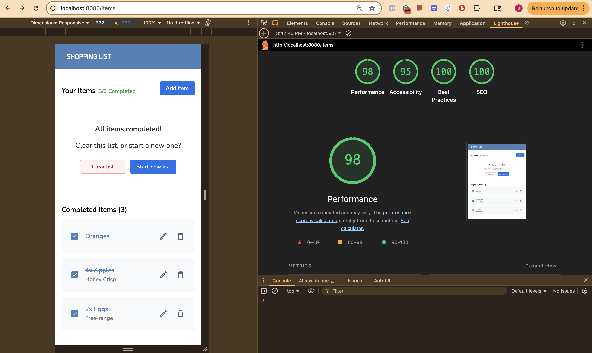

# Veritone Shopping List (Monorepo)

A TypeScript monorepo with a React (Webpack) frontend and a Node/Express backend, sharing utilities through a shared package.

- `apps/web` - React app (Webpack 5, Jest + RTL, Tailwind)
- `apps/server` - Express API (Jest, Supertest, Prisma)
- `shared` - Shared TS and schemas code used by both apps
- **Tooling** - npm workspaces, ESLint v9 flat config, Prettier, GitHub Actions CI, Docker

## Table of Contents

- [Tech Stack](#tech-stack)
- [Performance & Accessibility](#performance--accessibility)
- [Basic Repo Layout](#repo-layout)
- [Prerequisites](#prerequisites)
- [Quick Start (Local Dev)](#quick-start-local-dev)
- [Environment Variables](#environment-variables)
- [Scripts (Root)](#scripts-root)
- [App-specific Commands](#app-specific-commands)
  - [Web](#web)
  - [Server](#server)
- [Testing](#testing)
- [Lint & Format](#lint--format)
- [Typecheck & Build](#typecheck--build)
- [Docker Quick Start (Dev Images)](#docker-quick-start-dev-images)
- [Artifacts (Web Build)](#artifacts-web-build)
- [CI (Github Actions)](#ci-github-actions)
- [Non-root Guarantee](#non-root-guarantee)
- [Credits](#credits)

## Tech Stack

- **Language**: TypeScript (ES2022 target)
- **Frontend**: React 18, Webpack 5, TailwindCSS
- **Backend**: Node 22, Express, Prisma
- **Testing**: Jest, React Testing Library, Supertest
- **Tooling**: npm workspaces, ESLint v9 (flat config), Prettier, Husky
- **CI**: GitHub Actions (lint, test, typecheck, build, Docker smoke builds, artifact upload)
- **Container Images**: `postgres:16-alpine`, `nginxinc/nginx-unprivileged:1.27.4-alpine`
- **Fonts**: `@fontsource/dosis` and `@fontsource/nunito`

## Performance & Accessibility (Lighthouse)

_Audited inside Docker on 2025-10-02 at commit `3cf15ba8cc`, Chrome 128. Scores can vary by machine._

| Target      | Performance | Accessibility | Best Practices | SEO |
| ----------- | ----------- | ------------- | -------------- | --- |
| **Mobile**  | 98          | 95            | 100            | 100 |
| **Desktop** | 100         | 95            | 100            | 100 |

**Reports:** [Desktop](docs/lighthouse/desktop.html) · [Mobile](docs/lighthouse/mobile.html)

**Screenshots:**
  


## Repo Layout

```pgsql
.
├─ apps/
│  ├─ web/                 # React SPA
│  └─ server/              # Express API
├─ shared/                 # Shared TS utilities/types
├─ .github/workflows/ci.yml
├─ eslint.config.mjs
├─ tsconfig.base.json
├─ package.json
└─ .prettierrc
```

## Prerequisites

- Node.js v22+
- npm v10+
- (Optional) Docker 24+
- (Optional) PostgreSQL if running API locally with Prisma

## Quick Start (Local Dev)

```bash
# Install deps
npm install

# (optional) regenerates Prisma client
npm run -w @app/server prisma:generate
npm run -w @app/server prisma:migrate:dev

# Run Server (port 3001)
npm run dev:server

# Run Web (port 3000)
npm run dev:web

# Run both together (parellel)
npm run dev

```

## Environment Variables

### Root `.env.example`

```env
NODE_ENV=development
PORT=3001
DATABASE_URL=postgresql://veritoneuser:veritonepassword@db:5432/veritonedb?schema=public
```

### Web `.env.example`

```env
NODE_ENV=development
API_BASE_URL=http://localhost:3001
```

Copy and adjust as needed

```bash
cp .env.example .env
cp apps/web/.env.example apps/web/.env
```

## Scripts (Root)

```json
{
  "docker:up": "docker compose up --build",
  "docker:down": "docker compose down -v",

  "dev:server": "npm run -w @app/server dev",
  "dev:web": "npm run -w @app/web dev",
  "dev": "npm run dev:server & npm run dev:web",

  "test:server": "npm run -w @app/server test",
  "test:web": "npm run -w @app/web test",
  "test": "npm run test:server && npm run test:web",

  "lint": "eslint .",
  "format": "prettier . --write",
  "format:check": "prettier . --check",

  "typecheck": "tsc -b",
  "build": "tsc -b --force",
  "clean": "tsc -b --clean && rimraf **/dist"
}
```

## App-specific Commands

### Web

```bash
npm run -w @app/web dev
npm run -w @app/web build
npm run -w @app/web test
```

### Server

```bash
npm run -w @app/server dev
npm run -w @app/server build
npm run -w @app/server test
npm run -w @app/server prisma:generate
```

## Testing

- Run all tests: `npm run test`
- Web only: `npm run test:web`
- Server only: `npm run test:server`
- CI runs tests with `--passWithNoTests` so empty suites don’t fail.

## Lint & Format

- Run ESLint: `npm run lint`
- Run Prettier Check: `npm run format:check`
- Fix Formatting: `npm run format`

## Typecheck & Build

```bash
npm run typecheck   # Validate types only
npm run build       # Build all workspaces
```

Per app:

```bash
npm run -w @app/web build
npm run -w @app/server build
```

## Docker Quick Start (Dev Images)

Run both **server** and **web** in Docker with one command:

```bash
npm run docker:up
```

To stop and clean up volumes (DB data, etc.):

```bash
npm run docker:down
```

> Note: `.env.development` is committed intentionally for the challenge to enable one-command startup. Values are development-only and not used in production.

## Artifacts (Web Build)

CI uploads the web build (`apps/web/dist`) as an artifact named `web-dist`.

To test locally:
Note: Server must be running

```bash
unzip web-dist.zip -d web-dist
# serve must be installed globally
# npm i -g serve
npx serve -s web-dist -l 5000
open http://localhost:5000
```

## CI (Github Actions)

CI runs on PRs and pushes to main:

1. Detects changed workspaces
2. Lints + Prettier check
3. Typechecks, builds, runs tests (per workspace)
4. Builds Docker images (PR only, smoke test)
5. Uploads web artifact

## Non-root guarantee

- **Web** runs as user 101 (`nginxinc/nginx-unprivileged`) on 8080.
- **Server** runs as user app (non-root) on 3001.
- No privileged ports are used. Containers do not require root to run.

## Credits

- Icons by [Icons8](https://icons8.com)
